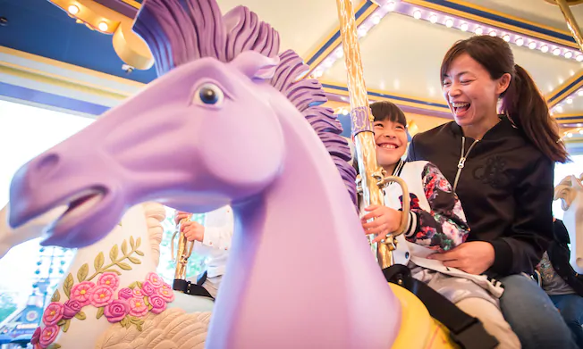
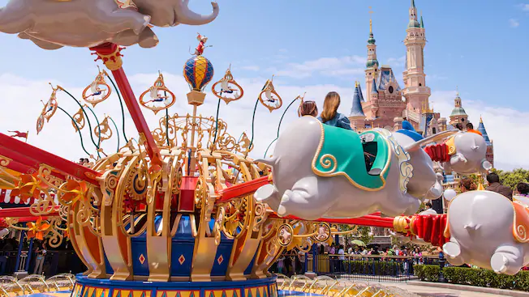
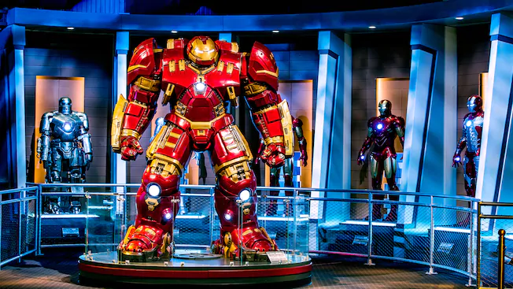
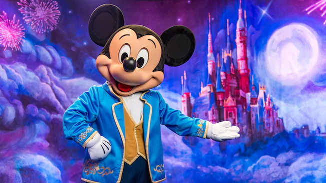

# 가든 오브 이매지네이션

미키 애비뉴와 디즈니 캐슬 사이에 위치한 정원. 아이들이 이 곳에 매료되기 때문인지 회전목마형 어트랙션 딱 2개만 있는데도 대기시간이 50분 밑으로 안 내려오는 기염을 토하는 공간이다. 이그나이트 불꽃놀이가 시작될 때에는 이 곳에 대다수의 입장객들이 전부 모인다.

**어트랙션**

* 판타지 캐러셀 : 회전목마다.

* 덤보, 하늘을 나는 코끼리 : 회전목마다.

* 마블 유니버스 : 마블 캐릭터의 전시공간. 아이언맨의 격납고가 있다. 아이언맨, 캡틴 아메리카로 분장할 수 있는 공간과 아이언맨, 스파이더맨 게임이 있다. 다만 전부 중국어다.

* 미키 텐트 만나기 : 클로즈업 준비, 세계적으로 유명한 미키 마우스와 대면하기 전에 마법에 걸린 갤러리 전시회를 방문하세요.

  
스탬프를 찍을 수 있는 기계는 마블 유니버스, 판타지 캐러셀의 뒷골목 두 군데.

