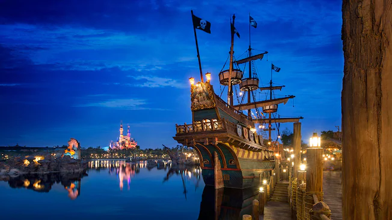

# 트레져 코브

해적과 바다를 테마로한 구역. 배가 두 대나 있기 때문에 어드벤처 아일과 공간을 공유하고 있지만 분위기가 구별되어 있다.

**어트랙션** \(★은 패스트패스 이용 가능 어트랙션\)

* 캐리비안의 해적 - 침몰선의 전투 ★ : 캐리비안의 해적을 소재로한 유명한 어트렉션. 상하이는 가장 최근에 만들어진 캐리비안의 해적이니만큼 최신식 기술과 거대한 화면을 아낌없이 투입하여 다른 디즈니랜드에서 타봤더라도 상하이 방문 시 꼭 한 번은 다시 타야하는 다크라이드로 격상했다. VR의 체험도는 소어링 오브 호라이즌에 절대 밀리지 않을 정도.

* 사이렌의 복수 : 부두에 정박해있는 해적선에 올라가 볼 수 있는 어트렉션.

* 익스플로어 캐넌즈 : 물을 뿜어대는 장식품들 등등이 위치한 체험 어트렉션. 인정사정없이 물을 뿜기 때문에 물에 젖을 것을 대비해야한다.

* 난파선 쇼어 : 트레져 코브에 있는 해적 갤런의 난파선에 세워진 놀라운 쌍방향 놀이공원에서 탐험할 수 있다.

  
스탬프를 찍는 기계는 침몰선 근처의 한 군데.

