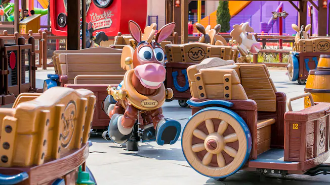

# 디즈니∙픽사 토이스토리 랜드

토이스토리의 공간으로 들어온 것만 같은 느낌을 받을 수 있는 장소. 투모로우랜드와 판타지랜드 사이에 위치해있다. 우디의 동상이 있는 입구, 제시의 동상이 있는 입구 2군데가 있다. 렉스의 레이서와 우디의 라운덥은 상당한 인기임에도 패스트패스가 없어서 대기줄이 20분~50분으로 유동적이다. 타이밍이 중요.

**어트랙션**

* 렉스의 레이서 : 렉스와 트릭시의 대결을 테마로한 바이킹. 상하이 디즈니랜드에서 가장 스릴이 넘치는 어트랙션 중 하나.

* 우디의 라운덥 : 제시의 목장을 테마로 여러 말들이 끄는 마차를 타고 즐기는 어트랙션. 아이들용의 시시한 어트랙션으로 보일지 몰라도 의외로 좋은 기믹을 갖춘 재밌는 놀이기구이며 대기줄도 엄청 길다.

* 슬링키 도그 스핀 : 슬링키 모양의 빙글빙글 도는 놀이기구. 입장할 때 강아지껌 모양의 입장권을 주고 탑승 시 회수한다.

  
스탬프를 찍는 기계는 알의 장난감 가게 입구 근처의 한 군데.

