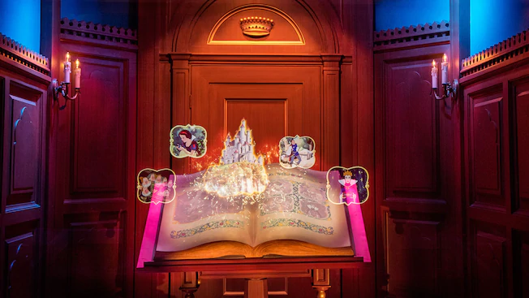
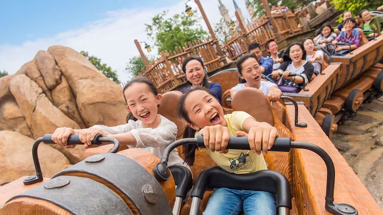
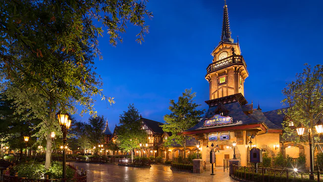
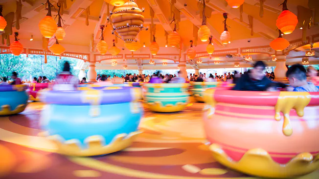
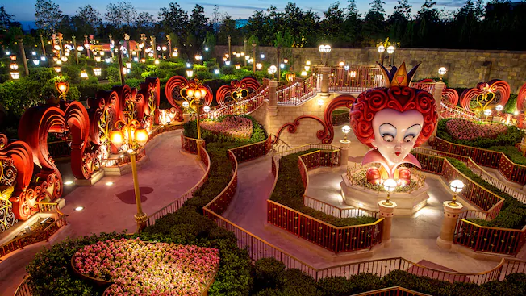
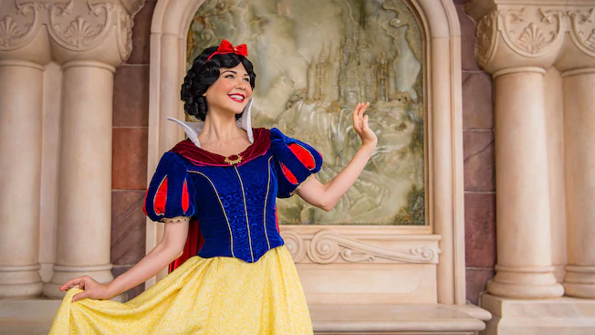

# 판타지랜드

백설공주, 라푼젤, 겨울왕국 등등 판타지와 프린세스를 테마로한 구역. 가장 규모가 크다. 캐슬의 뒷부분과 연결되어 있으며 성 내부로 들어갈 수 있는 곳이기도 하다. 패스트패스 놀이기구가 3곳이나 있다. 의외로 라푼젤을 테마로한 곳이 3곳이나 된다. 라푼젤팬들에게는 아쉬운 일이지만 극장은 겨울왕국이 재점령한 상태다.

**어트랙션** \(★은 패스트패스 이용 가능 어트랙션\)

* 원스 어폰 어 타임 어드벤처 : 백설공주를 주제로하여 성에 입장하여 백설공주 스토리를 돌아보는 공간. 다만 그냥 걸어다니는 공간이라 어른팬들에게는 조금 재미가 없을 수도 있다. 중국관객들 중에 아버지들이 아내와 딸을 들여보내고 대다수가 입구에서 이탈하는 진풍경을 볼 수 있다. 대기시간이 50분 가까이 된다.

* 일곱난쟁이와 광산열차 ★ : 상하이 디즈니랜드 최고의 어트랙션 중 하나. 난쟁이들의 광산에서 열차를 타고 달리는 테마의 어트렉션으로 레일의 꺾임의 각도가 엄청나기 때문에 취향에 따라서는 트론보다도 이 어트랙션을 최고로 치는 사람도 있다. 애니매트릭스의 퀄리티도 엄청나게 훌륭하다.

* 피터팬 플라이트 ★ : 다른 디즈니랜드에도 있는 피터팬을 테마로한 다크라이드.

* 곰돌이 푸의 수많은 모험들 ★ : 도쿄 디즈니랜드에서 선풍적인 인기를 끌었던 그 다크라이드. 내용은 같지만 애니매트릭스의 모양과 어트렉션의 기믹이 세세하게 차이점이 있다. 도쿄쪽의 사진을 찍는 기믹은 삭제되어있다.

* 크리스탈 그로토의 항해 : 조그마한 배를타고 판타지랜드 안의 호수를 돌아보는 다크라이드. 많은 캐릭터들을 만나볼 수 있고 마지막에는 깜짝 놀랄만한 기술력의 장소도 있다.

* 허니팟 스핀 : 곰돌이푸 테마의 회전컵. 굉장히 인기가 많다. 곰돌이푸 어트렉션이 2개이기 때문에 대기시간이 길다.

* 이상한 나라의 앨리스 미로 : 앨리스 \(팀버튼 실사영화 버전\)를 테마로한 공간. 입장해서 미로와 숲, 다과회 등을 둘러볼 수 있다. 낮과 밤이 분위기가 크게 다른데 밤에 일찍 문을 닫으니 밤에 보려면 직원에게 폐장 시간을 물어봐야한다.

* 스토리북 코트 : 디즈니 로얄티를 맞이하는 스토리북 코트에서 멋진 만남을 즐길 수 있다. 디즈니 공주는 가족, 친구, 즐거움으로 가득찬 "영원히 행복하게" 한 사람을 우아하게 환영한다.

  
스탬프를 찍는 기계는 캐슬의 외부 근처 \(공주들과 사진을 찍을 수 있는 곳 부분 유모차들이 잔뜩 늘어서있는 곳 근처다.\), 곰돌이푸 상점 내부, 앨리스의 미로 출구, 미키의동심포라는 상점 내부 네 군데.

