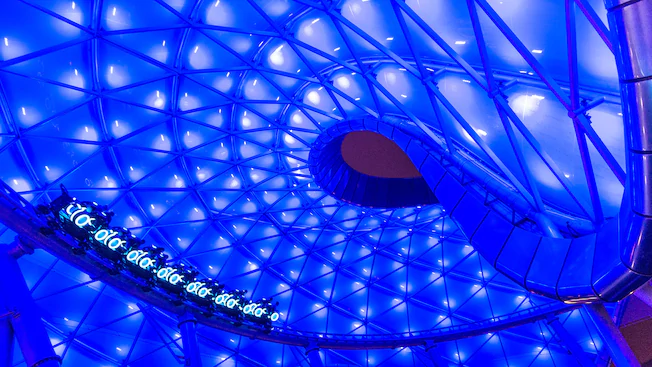
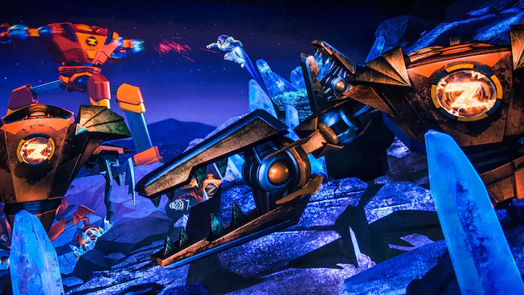
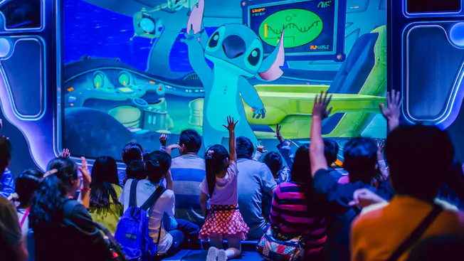
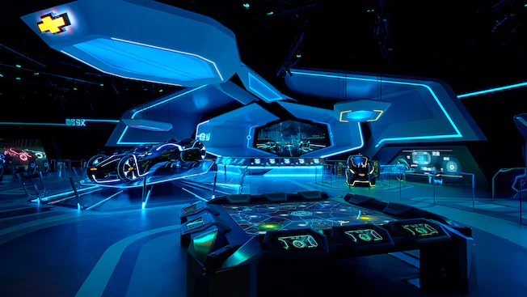

# 투모로우랜드

미래를 테마로한 구역.

**어트렉션** \(★은 패스트패스 이용 가능 어트랙션\)

* 트론 : 라이트 사이클 파워 런 ★ : **이 놀이기구를 타기 위해 상하이로 간다**는 말까지 나올 정도로 상하이의 상징인 어트렉션. 최근에 추가된 호라이즌과 래피즈, 백설공주 광산열차에 대기인원이나 시간에서 밀리는 감도 있지만 여전한 인기를 자랑한다.

* 버즈 라이트이어 플래닛 레스큐 ★ : 버즈 라이트이어 TV 애니메이션을 테마로한 다크라이드 슈팅 어트렉션. 도쿄에도 비슷한 어트렉션이 있으나 상하이는 버즈쪽 광선/저그쪽 광선으로 편을 나누어 탑승자들끼리 대결하는 기믹을 추가했다. 패스트패스 어트렉션들 중에 가장 대기시간이 짧다.

* 스티치 인카운터 : 스티치를 만나볼 수 있는 어트렉션. 스티치의 목소리를 맡은 캐스트가 아이들의 질문에 실시간으로 대답을 해준다. 다만 중국어이기 때문에 중국어를 모르는 외국인 입장객이라면 아무래도 즐기기가 어렵다. 자기에게 말을 걸어줄 것 같지가 않아서 먼저 나가는 부모와 아이들도 은근히 있는 편.

* 제트 팩스 : 회전하는 어트렉션으로 속도가 꽤 있는 편이다.

* 트론 왕국, 쉐보레 디지털 챌린지 : 사이버 운전자들이 TRON 세계의 최첨단 기술과 쉐보레 차량의 융합을 경험하는 대화형 원더랜드를 경험할 수 있다.

  
스탬프를 찍는 기계는 스티치 가게 내부와 투모로우랜드에서 제일 아래층에서 상점들 근처.

